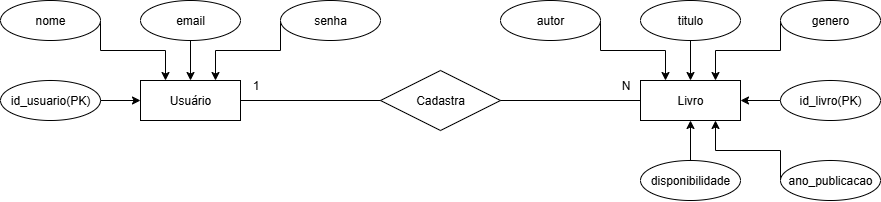

# 📘 Relatório do Projeto - API de livros 

## 🎯 Propósito e Ideia Geral
A API feita tem com o propósito de registrar informações de livros.
A ideia principal é oferecer uma API onde dê para registrar livros e suas informações, disponibilizando para aplicação em projetos com sistemas de organização.

Esta aplicação se destina a:
- **Bibliotecas**, que prescisam organizar seu acervo.
- **Livrarias**, que precisam fazer controle de estoque.
- **Usuários**, que tenham vontade de fazer sua probria organização de acervo.

O que se pretende fazer:
- Integração com um front-end


---

## ⚙️ Como Rodar a API

### 🔧 Pré-requisitos:
- Python 3.10+ (para rodar localmente)  
OU  
- Docker (para rodar em container)


---


### 🖥️ Opção 1: Rodando Localmente (Python)

###1. Clone o repositório:

```bash
git clone https://github.com/VictorAMJ/seu-repo.git
cd seu-repo
```
   
###2. Crie um ambiente virtual (opcional, mas recomendado):

```bash
   python -m venv venv
  venv\Scripts\activate # Windows
  source venv/bin/activate  # Linux/Mac
```

###3. Instale as dependências:
```bash
pip install -r requirements.txt
```

###4. Execute a API:
```bash
python app.py
```

A aplicação estará disponivel em:
📍 `http://127.0.0.1:5000`

📝 **Observação:** O banco de dados é criado automaticamente na primeira execução.


---


### 🐳 Opção 2: Rodando com Docker


###1. Clone o repositório:

```bash
git clone https://github.com/VictorAMJ/seu-repo.git
cd seu-repo
```

###2. Construa a imagem:

```bash
docker build -t api-livros .
```

###2. Rode o container:

```bash
docker run -p 5000:5000 api-livros
```

A aplicação estará disponivel em:
📍 `http://127.0.0.1:5000`


---


## 📡 Endpoints

#### 📚 Livro:
- `GET /livros` – Lista todas os livros;
- `POST /livro` – Cria um novo livro;
- `GET /livros/<id>` – Retorna os dados de um livro específico;
- `PUT /livros/<id>` –  Atualiza os dados de um livro;
- `DELETE /livros/<id>` – Deleta um livro existente;

### 📖 Documentação Swagger:
- `http://127.0.0.1:5000/apidocs`


---


## 🛠️ Stack e Tecnologias Utilizadas

### Back-end:
- Flask
- Flask-SQLAlchemy
- Flasgger

### Banco de Dados:
-SQLite

### Ambiente/Infra:
-Python 3.11
-Docker

### Controle de Versão:
- Git e GitHub


---


## 🗂️ Diagrama ER:
O modelo de dados da aplicação foi estruturado conforme o diagrama abaixo:



> O diagrama foi criado no Draw.io.


---


## 🧑‍💻 Autores

- Gabriela Araujo Rodrigues _ RA: 2400466
- Victor Alexandre Martuzzo de Jesus _ RA: 2400690
